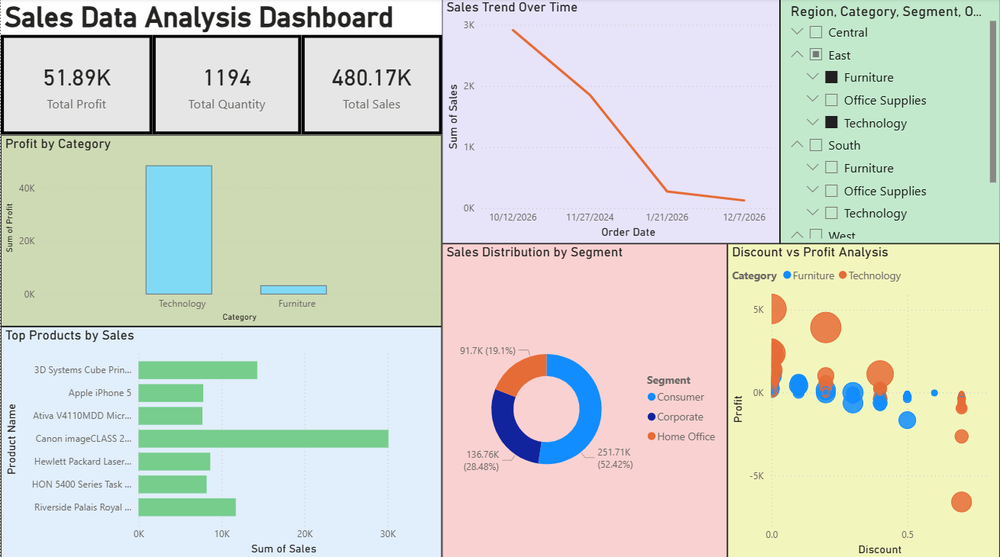

#Sales Data Analysis Dashboard

##Overview

This project analyzes sales data to understand business performance based on sales trends, product performance, and profit analysis.

##Tools Used

- Python (Pandas, Matplotlib)
- Power BI

##Features

- Data Cleaning
- Data Visualization
- Sales Trend Analysis
- Top Product Identification
- Profit Analysis Dashboard

##Dashboard

##Conclusion

Sales trends vary over time, and a few top products contribute significantly to overall sales. High discounts can reduce profit, highlighting the importance of effective pricing strategies.
